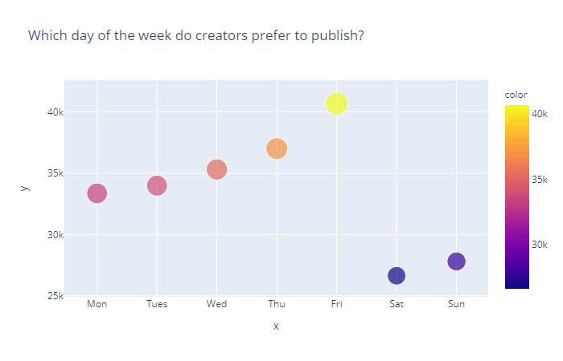
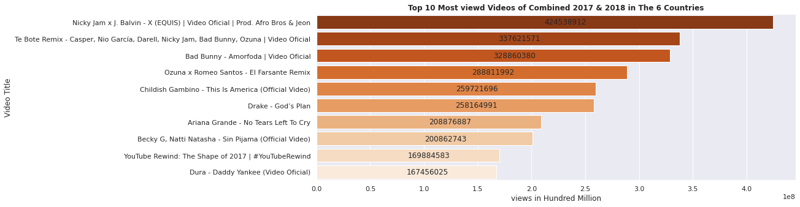

# Trending_YouTube_Videos_Analysis

   

  

**Abstract** -  Youtube, the world-famous content sharing
platform maintains a list of the most trending videos
which keeps updating everyday. Many videos of many
different categories are published every minute. It
maintains a track of user interactions(n umber of views,
shares, comments and likes) with every video. We utilized
that available data for this project, performing a detailed
analysis on the trending videos and the tagged user data.

Keywords—Youtube, Ensemble learning, Data Cleaning

<h4>
<b>I. INTRODUCTION</b>
</h4>

YouTube is the most popular and most used video
platform in the world today. It has a list of trending videos
that is updated constantly. We use Python and its data &
numeric computational libraries such as Pandas, nump,
Machine Learning libraries sklearn,xgb-boost and also
Matplotlib, Seaborn, json to analyze the dataset .The
dataset is a collection of around 2 lakh trending videos,
likes, dislikes, categories for 6 different regions(Canada,
Denmark, France, India, United Kingdom, United States of
America).The dataset that we will use is taken from
Kaggle. It contains data about trending videos for various
countries.
We will analyze this data to get insights of YouTube
trending videos, to see what is common between these
trends. Machine learning methods like Ensemble learning
have been used to predict the essential missing data.Those
insights might also be used by people who want to increase
the popularity of their videos on YouTube or just by the
people who want to surf through stats of their favorite
creator.

<h4>
<b>1.1. Why is it Important?</b>
</h4>
The main focus of this data analysis is to help the
content creators by giving them detailed analysis and also
help viewers to find interesting stats:

1. How many views do our trending videos have?
Do most of them have a large number of views? Is
having a large number of views required for a
video to become trending?

2. What factors contribute to make a particular video
a trending one?

3. Which category attracts most of the viewers?

4. When were trending videos published? On which
days of the week? at which times of the day?

5. Predicting category based on title of the video.

<h4>
<b>1.2 . INSPIRATION</b>
</h4>
Possible uses of this project could include:

1. Categorising YouTube videos based on their
comments and statistics.

2. Finding the most popular, most likes and disliked
videos on youtube

3. Analysing what factors affect how popular a
YouTube video will be.

4. Statistical analysis over time.

5. Predicting categories of videos published in
future.

<h4>
<b>II. LITERATURE REVIEW</b>
</h4>
To this date, it is difficult to find high-level statistics on
YouTube that paint a fair picture of the platform in its
entirety.This study attempts to provide an overall
characterization of YouTube, based on a random sample of
channel and video data, by showing how video provision
and consumption evolved over the course of the past few
years.Here are few works related to the study

1. Paper : CHENG Xu et.al, “Understanding the
YouTube and their data”, [IEEE,2014]

- Main Claims: This paper as the title suggests,
helped us to get the gist of the YouTube data. It
provides insights, many of them on various things
such as, how social aspects influence the
published videos and also talks about how
YouTube videos have noticeably different
statistics compared to traditional streaming
videos, ranging from length, access pattern, to
their active life span.

- Takeaway: The main takeaway from this paper is
how to work on YouTube data and how to search
for various aspects in the data to provide a good
analysis of the data

2. Paper: T he Philosophy of Exploratory Data
Analysis, 1987

- Main Claims: T his paper attempts to define
Exploratory Data Analysis (EDA) more precisely
than usual, and to produce the beginnings of a
philosophy of this topical and somewhat novel
branch of statistics

- Takeaway : Though this paper dates back to the
1980's it still helped us to grasp the basics of EDA
and how to perform it in the intended way

3. Paper: B huiyan, Hanif & Ara, Jinat & Bardhan,
Rajon & Islam, Dr. MD Rashedul. (2018).
Retrieving YouTube Video by Sentiment Analysis
on User Comment

- Main Claims: This paper is related to the
technique we are viewing to use for analysis on
the comments of the published videos. This
presents a Natural Language Processing (NLP)
based sentiment analysis approach on user
comments.
- Takeaway: T his paper helps to find out the most
relevant and popular video of YouTube according
to the search.

4. Paper: Thomas G. Dietterich, Ensemble Methods
in Machine Learning.

- Main Claims: This paper introduces and explains
ensemble learning methods and how they highly
help in implementing models with better performa
nce.
- Takeaway: This papers helps us to understand ho
w ensemble methods function.

<h4>
<b>III. PROPOSED SOLUTION</b>
</h4>
<h5>
<b>3.1. DATA EXPLORATION AND CLEANING</b>
</h5>
Our dataset comprises data of 6 different countries
[India, USA, Denmark, Canada, France, Great Britain].
After loading the data (in csv format) we extracted
category names from another source. We came across
missing data(In category attribute) for a few titles, which
might contain considerable weight in analysis. So we
implemented a ML model for predicting the missing data.
We cleaned the attributes which were unnecessary for
analysis using pandas tools. We created individual
dataframe for each country and also a cumulative
dataframe. Analysis has been done on data of 6 different
countries, i.e India,U.S.A, France, Great Britain,
Denmark, Canada. The insights are gathered collectively
on all 6 countries data.

<h5>
<b>3.2. MODEL</b>
</h5>
Around 600+ missing values were observed in the
‘Category’ attribute, some of which could be important in
analysing user interactions. To be able to predict these
missing categories, a Machine Learning model which uses
ensemble learning has been implemented. The reason to
choose ensemble methods is that individual classifiers
perform poorly on testing data. The below table shows the
results about performance of different classifiers and their
accuracy in predicting the categories.

<h5>
<b>3.3 . VISUALISATION</b>
</h5>
<h5>
<b>3.3.1 . AN ALYSIS ON IN DIVIDUAL COUNTRY [INDIA]</b>
</h5>

 

 

<h5>
<b>3.3.2. ANALYSIS ON CUMULATIVE DATA</b>
</h5>

 
 

 
 
 

<h4>
<b>IV. POSSIBLE IN SIGHTS</b>
</h4>
1. In four of six countries[IN,FR,DE,CA] the median
number of days for a published video to be
trended is around 1 to 2 days. While the other two
countries, US and GB have 6,12 days
respectively.

2. Month has no effect on the video that is being
published, it varies from country to country and in
India, most number of videos are posted in the
month of June.

3. There isn’t any effect of weekends on the number
of videos published, but it has been a common
trend that the highest number of videos have been
published on Friday in any of the six countries.

4. Time of posting in a day seems to be very
important for publishing. From our analysis it has
been observed that most number of videos are
being posted between 13:00 to 16:00 hrs for all
the countries.

5. Here, India had the most viewership around 13:00
and all the other countries had the most
viewership from around 4:00 to 5:00 hrs of the
day. The possible reason might be the time zone
differences. As all the other countries are westrern
parts, they have a common time zone, thus
leading to a common result.

6. We came to a conclusion that the videos which
have more views are also observed to have more
likes and dislikes.They are positively correlated.
The same thing is valid even for videos of a
particular category in all the countries.

7. The top 5 channels in any category also have the
top 5 viewership, likes and dislikes in most of the
cases.

8. ‘Entertainment’ has been the most famous
category in all the 6 countries.

9. Different countries have a different trend in how
long a video trends. The United Kingdom has a
longest trend duration of 35 days.

10. Friday has also the highest viewership among
weekdays.

11. “Late night show with Stephen Colbert” is the
most famous channel in the world

12. “Nicky Jam x J. Balvin - X (EQUIS) | Official
video | Prod. Afro Bros & Jeon” is the most
viewed video

13. 97.82% of videos have comments enabled.

14. Just 0.05% of videos have been removed

15. There has been a sudden and huge spike in views,
likes and comment_count between May and June
of 2018.

<h4>
<b>V. CONCLUSION</b>
</h4>
In this work we have presented how YouTube user
interactions can be used to find useful insights for creators
and also a fun stat check for viewers. We drew many
insights from the analysis, some of which can be vital for
creators. The Machine Learning model which we defined
ensures that this analysis would be also useful even in
further years as the missing data can be predicted. Overall
this is an insightful presentation of YouTube trending video
analysis.

<h4>
<b>VI. REFERENCES</b>
</h4>
[1] CHENG Xu et.al, “Understanding the
YouTube and their data”, [IEEE,2014]

[2] The Philosophy of Exploratory Data Analysis,
1987

[3] Bhuiyan, Hanif & Ara, Jinat & Bardhan,
Rajon & Islam, Dr. MD Rashedul. (2018)

[4] Visualizing data using Matplotlib and Seaborn
libraries in Python for data science.

[5] Thomas G. Dietterich, Ensemble Methods in
Machine Learning

[6] Top 50 matplotlib Visualizations – The
Master Plots

[7] Simple guide for ensemble learning methods

  

